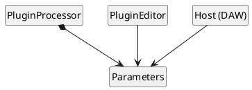

# Using Type Erasure to Extend APIs You Don't Own

## A Case Study From Audio Plugin Development

### Jan Wilczek (think-cell)

The Dutch C++ Group Meetup, Amsterdam, September 4th, 2026

---

# Who am I?

<v-clicks>

- Jan Wilczek \[Yan Vil-check\]
- C++ Speaker at think-cell
- Founder of TheWolfSound.com & online course creator

</v-clicks>

---
layout: cover
---


<!-- Please, interrupt me. I will be showing a lot of code so you may get lost. Please, stop me and ask question, even if it's just because you fell asleep -->

---
layout: center
---

# Who here knows what audio plugins for digital audio workstations are?

---
layout: center
---

# Who here has heard about the JUCE C++ framework?

---

# Key terms

<v-clicks>

- **audio plugin**: a plugin for a digital audio workstation (DAW)
- **plugin processor**: the core of an audio plugin; responsible for plugin metadata, audio processing, and state management
- **plugin editor**: user interface (UI) of the plugin
- **plugin parameter**: a user-controllable value influencing audio processing of a plugin
    - `juce::AudioParameterFloat|Bool|Int|Choice` class instance in JUCE plugins
- **UI state**: non-audio-related state
- **serialization**: process of externalizing state (for example, to a JSON file)
- **deserialization**: process of loading state from an external source (for example, a JSON file)
- **preset** = plugin parameter values + metadata

</v-clicks>

---

# Parameters in audio plugins



<v-clicks>

* Automation
* Serialization
* Presets (generic/custom)
* Visualization (generic/custom)
* UI (generic/custom)

</v-clicks>

---

# Example of plugin parameters in action

<div class="relative w-full h-full">
  <div v-click class="flex justify-center mt-4">
    
  </div>
  <div class="absolute bottom-10 left-0 right-0 h-60">
    
    
    
    
    
  </div>
</div>

---

# Parameter class hierarchy in JUCE

<div class="mt-30">
    
</div>

---

# JUCE parameter classes

<v-clicks>
 
* `AudioParameterBool`
  * `true`/`false`
* `AudioParameterInt`
  * integer in a closed range
  * e.g., "1" from \{0, 1, 2\}
* `AudioParameterFloat`
  * real value from a closed range
  * e.g., "0.25" from \[0, 2\]
* `AudioParameterChoice`
  * a value from a fixed set of named options
  * e.g., "lowpass" from \{"lowpass", "highpass"\}

</v-clicks>

---
layout: center
---

# The Story of a Synth

<!-- Well, let me tell you the story of developing my plugin -->

---


---


---

<style> .slidev-layout { zoom: 60%; }</style>

# Plugin processor

```cpp {all|40}
class EdenSynthAudioProcessor : public AudioProcessor {
public:
  EdenSynthAudioProcessor();
  ~EdenSynthAudioProcessor();

  void prepareToPlay(double sampleRate, int samplesPerBlock) override;
  void releaseResources() override;

#ifndef JucePlugin_PreferredChannelConfigurations
  bool isBusesLayoutSupported(const BusesLayout& layouts) const override;
#endif

  void processBlock(AudioBuffer<float>&, MidiBuffer&) override;

  AudioProcessorEditor* createEditor() override;
  bool hasEditor() const override;

  const String getName() const override;

  bool acceptsMidi() const override;
  bool producesMidi() const override;
  bool isMidiEffect() const override;
  double getTailLengthSeconds() const override;

  int getNumPrograms() override;
  int getCurrentProgram() override;
  void setCurrentProgram(int index) override;
  const String getProgramName(int index) override;
  void changeProgramName(int index, const String& newName) override;

  void getStateInformation(MemoryBlock& destData) override;
  void setStateInformation(const void* data, int sizeInBytes) override;

private:
  JUCE_DECLARE_NON_COPYABLE_WITH_LEAK_DETECTOR(EdenSynthAudioProcessor)

  std::filesystem::path _assetsPath;
  eden::EdenSynthesiser _edenSynthesiser;
  eden_vst::EdenAdapter _edenAdapter;
  AudioProcessorValueTreeState _pluginParameters;
};
```

---

# Parameters via `AudioProcessorValueTreeState`

```cpp {all|3|4-16|18}
EdenSynthAudioProcessor::EdenSynthAudioProcessor()
    : //...
      _pluginParameters{*this, nullptr} {
  using Parameter = juce::AudioProcessorValueTreeState::Parameter;

  _pluginParameters.createAndAddParameter(std::make_unique<Parameter>(
      "pitchBend.semitonesDown", "Pitch bend semitones down",
      NormalisableRange<float>(-24.f, 0.f, 1.f), -12.f));
  _pluginParameters.createAndAddParameter(std::make_unique<Parameter>(
      "pitchBend.semitonesUp", "Pitch bend semitones up",
      NormalisableRange<float>(0.f, 24.f, 1.f), 2.f));
  _pluginParameters.createAndAddParameter(std::make_unique<Parameter>(
      "frequencyOfA4", "Frequency of A4",
      NormalisableRange<float>(400.f, 500.f, 0.1f), 440.f,
      AudioProcessorValueTreeStateParameterAttributes{}.withLabel("Hz")));
  // more parameters...

  _pluginParameters.state = ValueTree(Identifier("EdenSynthParameters"));
}
```

 <!-- `createAndAddParameter()` API can be replaced with... -->

---

# Parameters via `AudioProcessorValueTreeState`

## New API

````md magic-move
```cpp
EdenSynthAudioProcessor::EdenSynthAudioProcessor()
    : //...
      _pluginParameters{*this, nullptr} {
  using Parameter = juce::AudioProcessorValueTreeState::Parameter;

  _pluginParameters.createAndAddParameter(std::make_unique<Parameter>(
      "pitchBend.semitonesDown", "Pitch bend semitones down",
      NormalisableRange<float>(-24.f, 0.f, 1.f), -12.f));
  _pluginParameters.createAndAddParameter(std::make_unique<Parameter>(
      "pitchBend.semitonesUp", "Pitch bend semitones up",
      NormalisableRange<float>(0.f, 24.f, 1.f), 2.f));
  _pluginParameters.createAndAddParameter(std::make_unique<Parameter>(
      "frequencyOfA4", "Frequency of A4",
      NormalisableRange<float>(400.f, 500.f, 0.1f), 440.f,
      AudioProcessorValueTreeStateParameterAttributes{}.withLabel("Hz")));
  // more parameters...

  _pluginParameters.state = ValueTree(Identifier("EdenSynthParameters"));
}
```
```cpp
EdenSynthAudioProcessor::EdenSynthAudioProcessor()
    : //...
      _pluginParameters{*this, nullptr, "EdenSynthParameters", {
          std::make_unique<AudioParameterFloat>(
              "pitchBend.semitonesDown", "Pitch bend semitones down",
              NormalisableRange<float>(-24.f, 0.f, 1.f), -12.f),
          std::make_unique<AudioParameterFloat>(
              "pitchBend.semitonesUp", "Pitch bend semitones up",
              NormalisableRange<float>(0.f, 24.f, 1.f), 2.f),
          std::make_unique<AudioParameterFloat>(
              "frequencyOfA4", "Frequency of A4",
              NormalisableRange<float>(400.f, 500.f, 0.1f), 440.f,
              AudioProcessorValueTreeStateParameterAttributes{}.withLabel("Hz")),
          // more parameters...
      }} {}
```
````

<!-- ...but it doesn't solve the issues of APVTS which I will show next -->

---

# Parameters via `AudioProcessorValueTreeState`

## Usage in audio processing

```cpp
void EdenSynthAudioProcessor::processBlock(AudioBuffer<float>& buffer,
                                           MidiBuffer& midiMessages) {
  //...

  _synthesiser.setPitchBendRange(
      {static_cast<int>(
           *pluginParameters.getRawParameterValue("pitchBend.semitonesDown")),
       static_cast<int>(
           *pluginParameters.getRawParameterValue("pitchBend.semitonesUp"))});
  _synthesiser.setFrequencyOfA4(
      *pluginParameters.getRawParameterValue("frequencyOfA4"));

  // audio & MIDI processing
}
```

---

# Parameters via `AudioProcessorValueTreeState`

## Serialization

```cpp
void EdenSynthAudioProcessor::getStateInformation(MemoryBlock& destData) {
  auto state = _pluginParameters.copyState();
  const std::unique_ptr<XmlElement> xml(state.createXml());
  copyXmlToBinary(*xml, destData);
}
```

---

# Parameters via `AudioProcessorValueTreeState`

## Deserialization

```cpp
void EdenSynthAudioProcessor::setStateInformation(const void* data,
                                                  int sizeInBytes) {
  std::unique_ptr<XmlElement> xmlState(getXmlFromBinary(data, sizeInBytes));

  if (xmlState.get()) {
    if (xmlState->hasTagName(_pluginParameters.state.getType())) {
      _pluginParameters.replaceState(ValueTree::fromXml(*xmlState));
    }
  }
}
```

---

# Parameters via `AudioProcessorValueTreeState`

## Usage in the plugin editor

```cpp {all|3|11-12|5}
class GeneralSettingsComponent : public Component {
public:
  using SliderAttachment = AudioProcessorValueTreeState::SliderAttachment;

  GeneralSettingsComponent(AudioProcessorValueTreeState&);

  void resized() override;
  void paint(Graphics& g) override;

private:
  Slider _pitchBendSemitonesUp;
  std::unique_ptr<SliderAttachment> _pitchBendSemitonesUpAttachment;

  Slider _pitchBendSemitonesDown;
  std::unique_ptr<SliderAttachment> _pitchBendSemitonesDownAttachment;

  Slider _a4Frequency;
  std::unique_ptr<SliderAttachment> _a4FrequencyAttachment;
};
```

---

# Parameters via `AudioProcessorValueTreeState`

## Usage in the plugin editor

```cpp {all|7-8}
GeneralSettingsComponent::GeneralSettingsComponent(
    AudioProcessorValueTreeState& valueTreeState)
    : _pitchBendSemitonesUp{/* */},
      _pitchBendSemitonesDown{/* */},
      _a4Frequency{/* */} {
  addAndMakeVisible(_pitchBendSemitonesUp);
  _pitchBendSemitonesUpAttachment = std::make_unique<SliderAttachment>(
      valueTreeState, "pitchBend.semitonesUp", _pitchBendSemitonesUp);

  addAndMakeVisible(_pitchBendSemitonesDown);
  _pitchBendSemitonesDownAttachment = std::make_unique<SliderAttachment>(
      valueTreeState, "pitchBend.semitonesDown", _pitchBendSemitonesDown);

  addAndMakeVisible(_a4Frequency);
  _a4FrequencyAttachment = std::make_unique<SliderAttachment>(
      valueTreeState, "frequencyOfA4", _a4Frequency);
}
```

---
layout: center
---

# How to add presets? 🤔

---

# Reuse `get/setStateInformation()`

```cpp {all|2-3|4-6}
void savePreset(const std::string& presetName) {
    juce::MemoryBlock presetData;
    pluginProcessor.getStateInformation(result);
    const auto presetFile = juce::File{presetPathFromName(name)};
    presetFile.deleteFile();
    presetFile.appendData(presetData.getData(), presetData.getSize());
}
```

---

# Reuse `get/setStateInformation()`

```cpp {all|2|4-9|11-12}
void loadPreset(const std::string& presetName) {
  const auto presetFile = juce::File{presetPathFromName(name)};

  juce::MemoryBlock presetData;
  const auto result = presetFile.loadFileAsData(presetData);

  if (!result) {
    return;
  }

  pluginProcessor.setStateInformation(presetData.getData(),
                                      static_cast<int>(presetData.getSize()));
}
```

---

# Preset structure when using APVTS

```xml {all|4,7,9,15,22}
<?xml version="1.0" encoding="UTF-8"?>

<EdenSynthParameters>
  <PARAM id="envelope.adbdr.attack.curve" value="1.0"/>
  <PARAM id="envelope.adbdr.attack.time" value="30.0"/>
  <PARAM id="envelope.adbdr.breakLevel" value="0.6000000238418579"/>
  <PARAM id="envelope.adbdr.decay1.curve" value="1.0"/>
  <PARAM id="envelope.adbdr.decay1.time" value="20.0"/>
  <PARAM id="envelope.adbdr.decay2.curve" value="1.0"/>
  <PARAM id="envelope.adbdr.decay2.time" value="20000.0"/>
  <PARAM id="envelope.adbdr.release.curve" value="1.0"/>
  <PARAM id="envelope.adbdr.release.time" value="300.0"/>
  <PARAM id="filter.contourAmount" value="1.0"/>
  <PARAM id="filter.cutoff" value="1.0"/>
  <PARAM id="filter.passbandAttenuation" value="0.0"/>
  <PARAM id="filter.resonance" value="0.0"/>
  <PARAM id="frequencyOfA4" value="440.0"/>
  <!-- more parameters... -->
  <PARAM id="output.volume" value="1.0"/>
  <PARAM id="pitchBend.semitonesDown" value="-12.0"/>
  <PARAM id="pitchBend.semitonesUp" value="2.0"/>
  <PARAM id="waveshaper.autoMakeUpGain" value="0.0"/>
</EdenSynthParameters>
```

<!-- What's wrong with this code? (choice and bool params are float)-->
<!-- not very readable, since all values are float -->
<!-- APVTS stores parameters internally as references to RangedAudioParameter (base class) -->

---

# APVTS-based parameters

<style> .slidev-layout { zoom: 90%; }</style>

<v-clicks>

## Pros

- Easy to implement
- Automatic serialization of all parameters for free
- Can work (somewhat) for presets
- Easy UI attachments

## Cons

- Parameters mangled with UI state
- Little control over XML structure in serialization
- Values as `float`s (no meaningful values or types)
    - `processBlock()`
    - presets
- What if I want a different serialization format, like JSON?
- Other APVTS drawbacks, e.g., requires a message thread

</v-clicks>

---
layout: center
class: text-center
---

# What we did in the official JUCE course

## "References only"


---

# Parameters via references only

```cpp {all|7-9|6,11}
class PluginProcessor : public juce::AudioProcessor {
public:
    PluginProcessor();
    //...
    struct Parameters {
        explicit Parameters(juce::AudioProcessor&);
        juce::AudioParameterFloat& rate;
        juce::AudioParameterBool& bypassed;
        juce::AudioParameterChoice& waveform;
    };
    Parameters parameters{*this};
};
```

---

# Parameters via references only

<style> .slidev-layout { zoom: 60%; }</style>

```cpp
namespace {
auto& addParameterToProcessor(juce::AudioProcessor& processor, auto parameter) {
  auto& result = *parameter;
  processor.addParameter(parameter.release());
  return result;
}

juce::AudioParameterFloat& createModulationRateParameter(
    juce::AudioProcessor& processor) {
  constexpr auto versionHint = 1;
  return addParameterToProcessor(
      processor,
      std::make_unique<juce::AudioParameterFloat>(
          juce::ParameterID{"modulation.rate", versionHint}, "Modulation rate",
          juce::NormalisableRange<float>{0.1f, 20.f, 0.01f, 0.4f}, 5.f,
          juce::AudioParameterFloatAttributes{}.withLabel("Hz")));
}

juce::AudioParameterBool& createBypassedParameter(
    juce::AudioProcessor& processor) {
  constexpr auto versionHint = 1;
  return addParameterToProcessor(
      processor,
      std::make_unique<juce::AudioParameterBool>(
          juce::ParameterID{"bypassed", versionHint}, "Bypass", false));
}

juce::AudioParameterChoice& createWaveformParameter(
    juce::AudioProcessor& processor) {
  constexpr auto versionHint = 1;
  return addParameterToProcessor(
      processor,
      std::make_unique<juce::AudioParameterChoice>(
          juce::ParameterID{"modulation.waveform", versionHint},
          "Modulation waveform", juce::StringArray{"Sine", "Triangle"}, 0));
}
} // namespace

Parameters::Parameters(juce::AudioProcessor& p)
    : rate{createModulationRateParameter(p)},
      bypassed{createBypassedParameter(p)},
      waveform{createWaveformParameter(p)} {}
```

---

# Parameters via references only

```cpp {all|21|11-16|2|3,5|4}
namespace {
auto& addParameterToProcessor(juce::AudioProcessor& processor, auto parameter) {
  auto& result = *parameter;
  processor.addParameter(parameter.release());
  return result;
}

juce::AudioParameterFloat& createModulationRateParameter(
    juce::AudioProcessor& processor) {
  constexpr auto versionHint = 1;
  return addParameterToProcessor(
      processor,
      std::make_unique<juce::AudioParameterFloat>(
          juce::ParameterID{"modulation.rate", versionHint}, "Modulation rate",
          juce::NormalisableRange<float>{0.1f, 20.f, 0.01f, 0.4f}, 5.f,
          juce::AudioParameterFloatAttributes{}.withLabel("Hz")));
}
} // namespace

Parameters::Parameters(juce::AudioProcessor& p)
    : rate{createModulationRateParameter(p)},
        /* ... */ {}
```

<!-- Note that we must release ownership -->

---

# Parameters via references only

## Usage in audio processing

```cpp
void PluginProcessor::processBlock(juce::AudioBuffer<float>& buffer,
                                   juce::MidiBuffer&) {
  //...
  tremolo.setModulationRateHz(parameters.rate.get());
  tremolo.setLfoWaveform(
      static_cast<Tremolo::LfoWaveform>(parameters.waveform.getIndex()));
  bypassTransitionSmoother.setBypass(parameters.bypassed.get());

  // audio processing
}
```

---

# Parameters via references only

## Usage in UI

```cpp {all|11-12|3}
class PluginEditor : public juce::AudioProcessorEditor {
public:
  explicit PluginEditor(PluginProcessor&);

  void resized() override;

private:
  juce::ComboBox waveformComboBox;
  juce::ComboBoxParameterAttachment waveformAttachment;

  juce::Slider rateSlider;
  juce::SliderParameterAttachment rateAttachment;

  juce::ToggleButton bypassButton{"BYPASSED"};
  juce::ButtonParameterAttachment bypassAttachment;
};
```

---

# Parameters via references only

## Usage in UI

```cpp {none|1,4}
PluginEditor::PluginEditor(PluginProcessor& p)
    : AudioProcessorEditor(&p),
      waveformAttachment{p.parameters.waveform, waveformComboBox},
      rateAttachment{p.parameters.rate, rateSlider},
      bypassAttachment{p.parameters.bypassed, bypassButton} {}
```

---

# Parameters via references only

## Serialization

```cpp {none|1-4|6-14|3}
void PluginProcessor::getStateInformation(juce::MemoryBlock& destData) {
  juce::MemoryOutputStream outputStream{destData, true};
  JsonSerializer::serialize(parameters, outputStream);
}

void PluginProcessor::setStateInformation(const void* data, int sizeInBytes) {
  juce::MemoryInputStream inputStream{data, static_cast<size_t>(sizeInBytes),
                                      false};
  const auto result = JsonSerializer::deserialize(inputStream, parameters);
  if (result.failed()) {
    // notify the user
  }
  // optionally skip smoothing
}
```

<!-- serialize() hides the complexity -->

---

# Parameters via references only

## Serialization

<style> .slidev-layout { zoom: 80%; }</style>

```cpp {all|2-4,24-25}
struct SerializableParameters {
  float rate;
  bool bypassed;
  juce::String waveform;

  static constexpr auto marshallingVersion = 1;

  template <typename Archive, typename T>
  static void serialise(Archive& archive, T& p) {
    using namespace juce;

    if (archive.getVersion() != 1) {
      return;
    }

    std::string pluginName = TREMOLO_PLUGIN_NAME;

    archive(named("pluginName", pluginName));

    if (pluginName != TREMOLO_PLUGIN_NAME) {
      return;
    }

    archive(named("modulationRateHz", p.rate), named("bypassed", p.bypassed),
            named("modulationWaveform", p.waveform));
  }
};
```

<!-- Key point: we need a separate struct that describes parameter values (duplication) -->

---


```cpp {9-10|1-7,11|17-20}
SerializableParameters from(const Parameters& p) {
  return {
      .rate = p.rate.get(),
      .bypassed = p.bypassed.get(),
      .waveform = p.waveform.getCurrentChoiceName(),
  };
}

void JsonSerializer::serialize(const Parameters& parameters,
                               juce::OutputStream& output) {
  const auto json = juce::ToVar::convert(from(parameters));

  if (!json.has_value()) {
    return;
  }

  juce::JSON::writeToStream(output, *json,
                            juce::JSON::FormatOptions{}
                                .withSpacing(juce::JSON::Spacing::multiLine)
                                .withMaxDecimalPlaces(2));
}
```

<!-- And deserialization code is very similar  -->

---

# Concrete-type based parameters

<v-clicks>

## Pros

- Full type safety
- Easy access to singular parameters
    - `processBlock()`
- We can use any serialization format we like
- Serialization code can be reused for presets
- Easy UI attachments
- Possibility to add UI state serialization

## Cons

- "Manual" serialization code
    - Adding new parameters requires updating `JsonSerializer` $\implies$ error-prone

</v-clicks>

---

# Summary so far

1. We can treat plugin parameters as a collection of `juce::RangedAudioParameter`s (just like `juce::AudioProcessorValueTreeState`) $\implies$ We lose type information
1. We can treat plugin parameters individually using only concrete `juce::AudioParameterFloat|Bool|Int|Choice` classes $\implies$ We cannot (easily) define operations on a collection of parameters

---

# Summary so far

1. Parameter collection: extensibility
1. Individual parameters: interpretability

---
layout: center
---

# How can we treat parameters as a collection without losing type information? 🤔

<v-click>
<h2>Answer: Type Erasure!</h2>
</v-click>

<!-- I don't want explain what type erasure is. Instead we'll discover this pattern while solving this problem. -->

---
layout: center
class: text-center
---

# Type-Erased Parameters

---

# Collection of parameters

```cpp
class TypeErasedParameter;

std::vector<TypeErasedParameter> parameters;
```

---

# `TypeErasedParameter`

````md magic-move
```cpp
class TypeErasedParameter {
public:
    TypeErasedParameter(juce::AudioParameterFloat& p) : _p{p} {}

private:
    juce::AudioParameterFloat& _p;
};
```
```cpp
class TypeErasedParameter {
public:
    template <class Parameter>
    TypeErasedParameter(Parameter& p) : _p{p} {}

private:
    Parameter& _p;
};
```
```cpp
template <class Parameter>
class TypeErasedParameter {
public:
    TypeErasedParameter(Parameter& p) : _p{p} {}

private:
    Parameter& _p;
};
```
```cpp
template <class Parameter>
class TypeErasedParameter {
public:
    TypeErasedParameter(Parameter& p) : _p{p} {}

private:
    Parameter& _p;
};

std::vector<TypeErasedParameter<?>> parameters;
```
```cpp
class TypeErasedParameter {
public:
    template <class Parameter>
    TypeErasedParameter(Parameter& p) : _impl{std::make_unique<ParameterModel<Parameter>>(p)} {}

private:
    template <class Parameter>
    class ParameterModel {
    public:
        ParameterModel(Parameter& p) : _p{p} {}
    private:
        Parameter& _p;
    };

    std::unique_ptr<ParameterModel<?>> _impl; // <- problem
};
```
```cpp
class TypeErasedParameter {
public:
    template <class Parameter>
    TypeErasedParameter(Parameter& p) : _impl{std::make_unique<ParameterModel<Parameter>>(p)} {}

private:
    class ParameterConcept {
    public:
        virtual ~ParameterConcept() = default;
    };

    template <class Parameter>
    class ParameterModel : public ParameterConcept {
    public:
        ParameterModel(Parameter& p) : _p{p} {}
    private:
        Parameter& _p;
    };

    std::unique_ptr<ParameterConcept> _impl;
};
```
```cpp
class TypeErasedParameter {
public:
    template <class Parameter>
    TypeErasedParameter(Parameter& p) : _impl{std::make_unique<ParameterModel<Parameter>>(p)} {}

private:
    class ParameterConcept {
    public:
        virtual ~ParameterConcept() = default;
    };

    template <class Parameter>
    class ParameterModel : public ParameterConcept {
    public:
        ParameterModel(Parameter& p) : _p{p} {}
    private:
        Parameter& _p;
    };

    std::unique_ptr<ParameterConcept> _impl;
};

std::vector<TypeErasedParameter> parameters;
```
````

<!-- Nice! We have our TypeErasedParameter, but what have achieved? Well, we can now store parameters of arbitrary types in a vector. We don't use any hacks, we don't use the pointer to base in the public-facing API, and we are entirely type-safe. Now, we want to make useful operations on the parameters; how?  -->

---

# Operations

````md magic-move
```cpp {1-3|all}
void foo(juce::AudioParameterFloat& p);
void foo(juce::AudioParameterBool& p);
//...
class TypeErasedParameter {
public:
    //...

private:
    class ParameterConcept {
    public:
        virtual ~ParameterConcept() = default;
    };

    template <class Parameter>
    class ParameterModel : public ParameterConcept {
    public:
        //...
    private:
        Parameter& _p;
    };

    std::unique_ptr<ParameterConcept> _impl;
};
```
```cpp {all|1-3,7,12,18}
void foo(juce::AudioParameterFloat& p);
void foo(juce::AudioParameterBool& p);
//...
class TypeErasedParameter {
public:
    //...
    void foo() { _impl->foo(); }
private:
    class ParameterConcept {
    public:
        virtual ~ParameterConcept() = default;
        virtual void foo() = 0;
    };
    template <class Parameter>
    class ParameterModel : public ParameterConcept {
    public:
        //...
        void foo() override { foo(_p); }

    private:
        Parameter& _p;
    };
    std::unique_ptr<ParameterConcept> _impl;
};
```
```cpp {1-3,7,12,18}
void serializeToJson(juce::AudioParameterFloat& p);
void serializeToJson(juce::AudioParameterBool& p);
//...
class TypeErasedParameter {
public:
    //...
    void serializeToJson() { _impl->serializeToJson(); }
private:
    class ParameterConcept {
    public:
        virtual ~ParameterConcept() = default;
        virtual void serializeToJson() = 0;
    };
    template <class Parameter>
    class ParameterModel : public ParameterConcept {
    public:
        //...
        void serializeToJson() override { serializeToJson(_p); }

    private:
        Parameter& _p;
    };
    std::unique_ptr<ParameterConcept> _impl;
};
```
````

<!-- I don't like the approach using free functions; we would probably need to come up with long function names to avoid argument-dependent lookup. Furthermore, each serialization mechanism, requires adding a separate function or linking to a separate free function definition set. Can we do better? -->

---

# Serialization

```cpp {1-6,11,16,22}
struct Serializer {
    virtual ~Serializer = default;
    virtual void serializeToJson(juce::AudioParameterFloat& p) = 0;
    virtual void serializeToJson(juce::AudioParameterBool& p) = 0;
    //...
};

class TypeErasedParameter {
public:
    //...
    void serialize(Serializer& s) { _impl->serialize(s); }
private:
    class ParameterConcept {
    public:
        virtual ~ParameterConcept() = default;
        virtual void serialize(Serializer&) = 0;
    };
    template <class Parameter>
    class ParameterModel : public ParameterConcept {
    public:
        //...
        void serialize(Serializer& s) override { serializer.serialize(_p); }

    private:
        Parameter& _p;
    };
    std::unique_ptr<ParameterConcept> _impl;
};
```

<!-- Each new operation requires adding 3 functions. Cannot we streamline it? -->

---

# Operations supporting all JUCE parameter classes

```cpp {1-6,11,16,22}
struct Visitor {
    virtual ~Visitor = default;
    virtual void visit(juce::AudioParameterFloat& p) = 0;
    virtual void visit(juce::AudioParameterBool& p) = 0;
    //...
};

class TypeErasedParameter {
public:
    //...
    void accept(Visitor& v) { _impl->accept(v); }
private:
    class ParameterConcept {
    public:
        virtual ~ParameterConcept() = default;
        virtual void accept(Vistior&) = 0;
    };
    template <class Parameter>
    class ParameterModel : public ParameterConcept {
    public:
        //...
        void accept(Visitor& v) override { v.visit(_p); }

    private:
        Parameter& _p;
    };
    std::unique_ptr<ParameterConcept> _impl;
};
```

<!-- Ok, we know how to define operations on a single `TypeErasedParameter` object. But we designed the class primarily to treat it as a collection. How to use `TypeErasedParameters` as a collection? -->

---

# Collection of `TypeErasedParameter`s

```cpp
std::vector<TypeErasedParameter> parameters;
```

---

# Collection of `TypeErasedParameter`s

<style> .slidev-layout { zoom: 60%; }</style>

```cpp {all|2-29|42|42,32-33|42,35-39|all}
class ParameterHolder {
  class TypeErasedParameter {
  public:
    template <class Parameter>
    explicit TypeErasedParameter(Parameter& p)
        : _impl{std::make_unique<ParameterModel<Parameter>>(p)} {}

    void accept(Visitor& v) { _impl->accept(v); }

  private:
    class ParameterConcept {  // NOLINT
    public:
      virtual ~ParameterConcept() = default;
      virtual void accept(Visitor& v) = 0;
    };

    template <class Parameter>
    class ParameterModel : public ParameterConcept {
    public:
      explicit ParameterModel(Parameter& p) : _p{p} {}

      void accept(Visitor& v) override { v.visit(_p.get()); }

    private:
      Parameter& _p;
    };

    std::unique_ptr<ParameterConcept> _impl;
  };

public:
  explicit ParameterHolder(std::vector<TypeErasedParameter> parameters)
      : _parameters{std::move(parameters)} {}

  void accept(Visitor& v) {
    for (auto& parameter : _parameters) {
      parameter.accept(v);
    }
  }

private:
  std::vector<TypeErasedParameter> _parameters;
};
```

<!-- But since we've already done all this work, why not add a Builder that helps in instantiating the ParameterHolder? -->

---

# Builder

```cpp {all|20|21|3-4|5|6|7,21|9|8,20|12-17|13-15,20|16,21|12|all}
class Builder {
public:
    template <class P, class... Args>
    P& add(Args&&... args) {
        auto parameter = std::make_unique<P>(std::forward<Args>(args)...);
        auto& ref = *parameter;
        _parametersForHolder.emplace_back(ref);
        _parameters.push_back(std::move(parameter));
        return ref;
    }

    ParameterHolder build(juce::AudioProcessor& p) && {
        for (auto&& parameter : _parameters) {
            p.addParameter(parameter.release());
        }
        return ParameterHolder{std::move(_parametersForHolder)};
    }

private:
    std::vector<std::unique_ptr<juce::AudioProcessorParameter>> _parameters;
    std::vector<TypeErasedParameter> _parametersForHolder;
};
```

---

# Builder

<style> .slidev-layout { zoom: 60%; }</style>

```cpp {11-32|36-38}
class ParameterHolder {
  class TypeErasedParameter {
  public:
    template <class Parameter>
    explicit TypeErasedParameter(Parameter& p)
        : _impl{std::make_unique<ParameterModel<Parameter>>(p)} {}
        //...
  };

public:
  class Builder {
  public:
    template <class P, class... Args>
    P& add(Args&&... args) {
      auto parameter = std::make_unique<P>(std::forward<Args>(args)...);
      auto& ref = *parameter;
      _parametersForHolder.emplace_back(ref);
      _parameters.push_back(std::move(parameter));
      return ref;
    }

    ParameterHolder build(juce::AudioProcessor& p) && {
      for (auto&& parameter : _parameters) {
        p.addParameter(parameter.release());
      }
      return ParameterHolder{std::move(_parametersForHolder)};
    }

  private:
    std::vector<std::unique_ptr<juce::AudioProcessorParameter>> _parameters;
    std::vector<TypeErasedParameter> _parametersForHolder;
  };

  void accept(Visitor& v) {/* ... */}

private:
  explicit ParameterHolder(std::vector<TypeErasedParameter> parameters)
      : _parameters{std::move(parameters)} {}

  std::vector<TypeErasedParameter> _parameters;
};
```

---

# Usage

```cpp {all|3-4|5-6,17|13,21}
class PluginProcessor : public juce::AudioProcessor {
public:
  explicit PluginProcessor(
      ParameterHolder::Builder builder = {})
      : floatParam{builder.add<juce::AudioParameterFloat>(
            "floatParam", "Float Param", juce::NormalisableRange{1.f, 10.f}, 5.f)},
        boolParam{builder.add<juce::AudioParameterBool>(
            "boolParam", "Bool Param", true)},
        intParam{builder.add<juce::AudioParameterInt>(
            "intParam", "Int Param", 5, 10, 6)},
        choiceParam{builder.add<juce::AudioParameterChoice>(
            "choiceParam", "Choice Param", juce::StringArray{"choice 0", "choice 1", "choice 2"}, 1)},
        parameterHolder{std::move(builder).build(*this)} {}

  //...
private:
  juce::AudioParameterFloat& floatParam;
  juce::AudioParameterBool& boolParam;
  juce::AudioParameterInt& intParam;
  juce::AudioParameterChoice& choiceParam;
  ParameterHolder parameterHolder;
};
```

<!-- So you can still access individual parameters, but now you can also perform operations on all of them easily (maintaining type safety) -->
<!-- Once we have all this in place, adding serialization is a breeze. -->

---

# Serialization using a Visitor

```cpp {none|1-4|6|9-14|17-22|15}
struct ParameterIdAndValue {
  std::string id;
  std::variant<float, int, bool, std::string> value;
};

class ParameterValuesExtractor : public Visitor {
public:
  ParameterValuesExtractor() = default;
  void visit(juce::AudioParameterFloat& parameter) override { visitImpl(parameter, parameter.get()); }
  void visit(juce::AudioParameterBool& parameter) override { visitImpl(parameter, parameter.get()); }
  void visit(juce::AudioParameterInt& parameter) override { visitImpl(parameter, parameter.get()); }
  void visit(juce::AudioParameterChoice& parameter) override {
      visitImpl(parameter, parameter.getCurrentChoiceName().toStdString());
  }
  [[nodiscard]] std::vector<ParameterIdAndValue> result() const { return _result; }
private:
  template <class P, class V>
  void visitImpl(const P& parameter, V&& value) {
    _result.emplace_back(parameter.getParameterID().toStdString(), std::forward<V>(value));
  }

  std::vector<ParameterIdAndValue> _result;
};
```

<!-- Then we can define SerialisationTraits for ParameterIdAndValue -->

---

# Serialization using a Visitor

```cpp
std::vector<ParameterIdAndValue> parameterIdsAndValues(ParameterHolder& ph) {
  ParameterValuesExtractor visitor;
  ph.accept(visitor);
  return visitor.result();
}
```

---
class: "!text-black"
---

# What if we want to support custom parameter classes?

<div>

$\implies$ make `ParameterHolder` templated on the `Visitor` class.

</div>

---

# What if we want to support custom parameter classes?

```cpp
template <class Visitor>
class ParameterHolder {
  //...
public:
  void accept(Visitor& v) {/* ... */}
  //...
};
```

---

# What if we want to support custom parameter classes?

## A good default

```cpp
struct JuceParameterVisitor {
  virtual ~JuceParameterVisitor() = default;
  virtual void visit(juce::AudioParameterBool&) = 0;
  virtual void visit(juce::AudioParameterFloat&) = 0;
  virtual void visit(juce::AudioParameterInt&) = 0;
  virtual void visit(juce::AudioParameterChoice&) = 0;
};

using JuceParameterHolder = ParameterHolder<JuceParameterVisitor>;
```

---

# Implementations

## `ParameterHolder` with example serialization

- https://github.com/JanWilczek/wolfsound-dsp-utils
    - *src/include/wolfsound/juce/wolfsound_ParameterHolder.hpp*

## `ParameterHolder` with serialization and presets (WIP)

- https://github.com/JanWilczek/EdenSynth/tree/add-xml-presets-macos-var-params
    - *EdenSynth/SharedCode/include/presets/Preset.h*
    - *EdenSynth/SharedCode_test/source/presets_test/PresetsTest.cpp*

---

# References

<v-clicks>

1. JUCE C++ framework source code, *https://github.com/juce-framework/JUCE*
1. Kevlin Henney, *Valued Conversions*, *C++ Report* July-August 2000
1. Sean Parent, *Inheritance Is the Base Class of Evil*, GoingNative 2013
1. Klaus Iglberger, *C++ Software Design: Design Principles and Patterns for High-Quality Software*, O'Reilly 2022
1. Jan Wilczek & the JUCE team, *Official JUCE Audio Plugin Development Online Course*, [*https://wolfsoundacademy.com/juce*](https://wolfsoundacademy.com/juce) (available for free)

</v-clicks>

<!-- Klaus Iglberger has multiple CppCon talks regarding type erasure. -->

---

# Summary

<v-clicks>

1. General: Use the Type Erasure design pattern together with the Visitor design pattern to manage collections of strongly typed objects of different classes

1. Specific: Use Type Erasure to perform operations on all parameter objects of your plugin without losing their type
    - Keep references to concrete parameter objects to access them individually

1. Try out/tweak `wolfsound::ParameterHolder` from *[github.com/JanWilczek/wolfsound-dsp-utils](https://github.com/JanWilczek/wolfsound-dsp-utils)*

1. Get slides at [*github.com/JanWilczek/adc26-japan-talk*](https://github.com/JanWilczek/adc26-japan-talk)

1. Contact me via contact@thewolfsound.com

</v-clicks>
<!-- If you have any questions or are interested in holding a company training, contact me at -->

