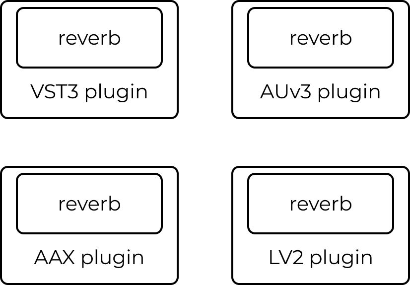
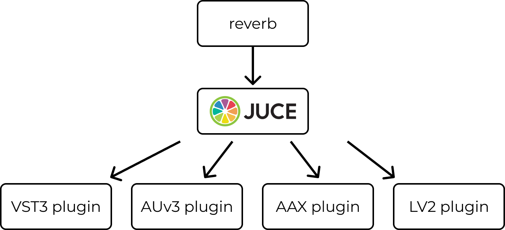
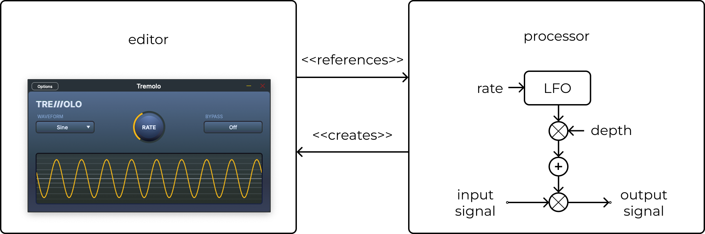
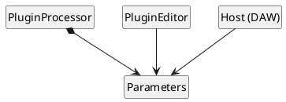
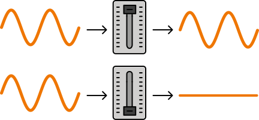

---

# Who am I?

<v-clicks>

- Jan Wilczek \[Yan Vil-check\]
- Founder of TheWolfSound.com & online course creator
- C++ Speaker at think-cell

</v-clicks>

---
layout: image
---


<!-- Please, interrupt me. I will be showing a lot of code so you may get lost. Please, stop me and ask question, even if it's just because you fell asleep -->

---
layout: center
---

# Who knows what audio plugins for digital audio workstations are?

---
layout: center
---

# Who has heard about the JUCE C++ framework?

---
layout: cover
---


<!-- Here's how a modern DAW looks like tracks, transport, assets, and... plugins. Plugins extend DAW capabilities: think sound synthesizers, and audio effects such as reverb -->

---

# Audio plugin formats


 <!-- DAWs communicate with plugins via plugin APIs also called plugin formats -->

---

# Audio plugin formats



 <!-- There are many of them... -->

---

# JUCE C++ framework



<!-- The JUCE C++ framework allows having a single codebase to generate wrappers for most of the mainstream plugin formats. It also allows general-purpose cross-platform app creation (think Qt). But today, we're not talking about audio processing algorithms, but about state management in audio plugins, in particular, audio parameters. -->

---

# Plugin processor and editor



 <!-- Plugins, in particular plugins created with JUCE, consist of two main classes: processor and editor. Think editor=UI and processor=audio processing, host communication, state management, and everything else. Part of the plugin's state are parameters; user-adjustable, UI-displayable, audio-controlling values. -->

---

# Parameters in audio plugins



---

# Example of plugin parameters in action

<div class="relative w-full h-full">
  <div v-click class="flex justify-center mt-4">
    
  </div>
  <div class="absolute bottom-10 left-0 right-0 h-60">
    
    
    
    
    
  </div>
</div>

---

# Gain parameter example



<p class="text-xs">
"level slider" by Sina Schulz from <a href="https://openmoji.org/library/emoji-1F39A/">openmoji.org</a> licensed under CC BY-SA 4.0, modified
</p>

 <!-- As an example, let's consider a plugin's volume, also called the gain. It can be represented as a floating-point value in the [0, 1] range that scales the plugin's output. 1 means no change in volume, and 0 means complete silence. Let's take a look at the requirements of such a parameter: -->

---

# Parameter class hierarchy in JUCE

<div class="mt-30">
    
</div>

---

# JUCE parameter classes

<v-clicks>
 
* `AudioParameterBool`
  * `true`/`false`
* `AudioParameterInt`
  * integer in a closed range
  * e.g., "1" from \{0, 1, 2\}
* `AudioParameterFloat`
  * real value from a closed range
  * e.g., "0.25" from \[0, 2\]
* `AudioParameterChoice`
  * a value from a fixed set of named options
  * e.g., "lowpass" from \{"lowpass", "highpass"\}

</v-clicks>

 <!-- We discussed a floating-point parameter but JUCE provides four types of parameters; we can create further types by extending one of the parameter classes. -->

---
layout: center
---

# How do we use parameters?

---

<style> .slidev-layout { zoom: 65%; }</style>

# Plugin processor

```cpp
class PluginProcessor : public AudioProcessor {
public:
  PluginProcessor();
  ~PluginProcessor();

  void prepareToPlay(double sampleRate, int samplesPerBlock) override;
  void releaseResources() override;

#ifndef JucePlugin_PreferredChannelConfigurations
  bool isBusesLayoutSupported(const BusesLayout& layouts) const override;
#endif

  void processBlock(AudioBuffer<float>&, MidiBuffer&) override;

  AudioProcessorEditor* createEditor() override;
  bool hasEditor() const override;

  const String getName() const override;

  bool acceptsMidi() const override;
  bool producesMidi() const override;
  bool isMidiEffect() const override;
  double getTailLengthSeconds() const override;

  int getNumPrograms() override;
  int getCurrentProgram() override;
  void setCurrentProgram(int index) override;
  const String getProgramName(int index) override;
  void changeProgramName(int index, const String& newName) override;

  void getStateInformation(MemoryBlock& destData) override;
  void setStateInformation(const void* data, int sizeInBytes) override;

private:
  juce::AudioParameterFloat& gain;

  JUCE_DECLARE_NON_COPYABLE_WITH_LEAK_DETECTOR(PluginProcessor)
};
```

---

# Parameters via references only

```cpp
class PluginProcessor : public juce::AudioProcessor {
public:
    PluginProcessor();
    //...
private:
    juce::AudioParameterFloat& gain;
    //...
};
```

 <!-- We cannot own the parameter classes (no unique_ptr, no values) to avoid double delete -->

---

# Parameters via references only

```cpp {all|13-14|2|4-6|8|7,9}
namespace {
juce::AudioParameterFloat& createGainParameter(juce::AudioProcessor& processor) {
  constexpr auto versionHint = 1;
  auto parameter = std::make_unique<juce::AudioParameterFloat>(
          juce::ParameterID{"gain", versionHint}, "Gain",
          juce::NormalisableRange<float>{0.f, 1.f, 0.01f}, 1.f);
  auto& result = *parameter;
  processor.addParameter(parameter.release());
  return result;
}
} // namespace

PluginProcessor::PluginProcessor() : //...
    gain{createGainParameter(*this)} {}
```

<!-- Note that we must release ownership -->

---

# Parameters via references only

## Usage in audio processing

```cpp
void PluginProcessor::processBlock(juce::AudioBuffer<float>& buffer,
                                   juce::MidiBuffer&) {
  //...
  buffer.applyGain(gain.get());
}
```

---

# Parameters via references only

## Usage in UI

```cpp
class PluginEditor : public juce::AudioProcessorEditor {
public:
  explicit PluginEditor(PluginProcessor&);
  //...
private:
  juce::Slider gainSlider;
  juce::SliderParameterAttachment gainAttachment;
};
```

---

# Parameters via references only

## Usage in UI

```cpp
PluginEditor::PluginEditor(PluginProcessor& p)
    : AudioProcessorEditor(&p),
      gainAttachment{p.gain, gainButton} {}
```

---

# Parameters via references only

## Serialization

```cpp {none|1-4|6-14}
void PluginProcessor::getStateInformation(juce::MemoryBlock& destData) {
  juce::MemoryOutputStream outputStream{destData, true};
  // write parameters to outputStream
}

void PluginProcessor::setStateInformation(const void* data, int sizeInBytes) {
  juce::MemoryInputStream inputStream{data, static_cast<size_t>(sizeInBytes),
                                      false};
  // read parameters from input stream
}
```

 <!-- JUCE provides `setStateInformation()` and `getStateInformation()` callbacks in the PluginProcessor to allows reading and writing plugin state (incl. parameters). -->

---

# Serialization

parameter IDs and human-readable values $\rightarrow$ data format (e.g., JSON)

## Example for gain

```cpp
juce::AudioParameterFloat& gain; // value: 1.f
// ⬇️
struct IdAndValue {
    std::string id; // "gain"
    float value;    // 1.f
};
```


---

# Serialization


```cpp
juce::AudioParameterFloat& floatParam;
juce::AudioParameterInt& intParam;
juce::AudioParameterBool& boolParam;
juce::AudioParameterChoice& choiceParam;
// ⬇️
struct IdAndValue {
    std::string id;
    std::variant<float,int,bool,std::string> value;
};
std::vector<IdAndValue> serializedParameters;
// ⬇️
// serialization to file and to stream
```

<!-- Serialization here is just a running example for an operation that operates on all parameters in our plugin -->

---

# Parameters via references only

## Serialization

```cpp
std::vector<IdAndValue> serializeParameters(juce::OutputStream& output, const juce::AudioParameterFloat& gain) {
    return {
        { .id = gain.getParameterID.toStdString(), .value = gain.get() }
    };
}
```

---

# Parameters via references only

## Serialization

```cpp
std::vector<IdAndValue> serializeParameters(juce::OutputStream& output,
    const juce::AudioParameterFloat& floatParam,
    const juce::AudioParameterInt& intParam,
    const juce::AudioParameterBool& boolParam,
    const juce::AudioParameterChoice& choiceParam) {

    return {
        { .id = floatParam.getParameterID.toStdString(),  .value = floatParam.get() }
        { .id = intParam.getParameterID.toStdString(),    .value = intParam.get() }
        { .id = boolParam.getParameterID.toStdString(),   .value = boolParam.get() }
        { .id = choiceParam.getParameterID.toStdString(), .value = choiceParam.getCurrentChoiceName() } // 👈
    };
}
```

<!-- Key point: we need to list all parameters individually. Also we must remember to call a different API on choiceParam -->

---

# Parameters via references only

## Serialization

```json
{
    "parameters": [
        {
            "id": "floatParam",
            "value": 1.0
        },
        {
            "id": "choiceParam",
            "value": "choice 1"
        },
        //...
    ]
}
```


---

# Parameters via references only

<v-clicks>

## Pros

- Full type safety
- Easy access to singular parameters
    - `processBlock()`
    - `PluginEditor`
- We can use any serialization format we like
- Serialization code can be reused for presets
- Easy UI attachments
- Possibility to add UI state serialization

## Cons

- "Manual" serialization code
    - Adding new parameters requires updating `serializeToJson` $\implies$ error-prone

</v-clicks>

---

# Parameters via a vector of base class pointers

<div class="mt-30">
    
</div>

```cpp
class PluginProcessor : public juce::AudioProcessor {
    //...
    juce::AudioParameterFloat& floatParam; // for audio processing & UI
    // remaining parameters...
    std::vector<juce::RangedAudioParameter*> parameters;
};

```

---

# Parameters via a vector of base class pointers

```cpp {all|8|4|15-16,21}
class JUCE_API RangedAudioParameter   : public AudioProcessorParameterWithID {
public:
    float convertTo0to1(float v) const noexcept;
    float convertFrom0to1(float v) const noexcept;

    // inherited:
    /* Hosts will expect the value returned to be between 0 and 1.0. */
    float getValue() const;
    /* The value passed will be between 0 and 1.0. */
    void setValue(float newValue);
};

class JUCE_API  AudioParameterBool  : public RangedAudioParameter {
public:
    bool get() const noexcept;
    operator bool() const noexcept;
    //...
};
class JUCE_API  AudioParameterChoice  : public RangedAudioParameter {
public:
    String getCurrentChoiceName() const;
    //...
};
```

---

# Parameters via a vector of base class pointers

```cpp {all|8}
std::vector<IdAndValue> serializeParameters(juce::OutputStream& output, std::vector<juce::RangedAudioParameter*> parameters) {
    return
        parameters
            | std::views::transform(
                [](auto const* p) -> IdAndValue {
                    return {
                        .id = p->getParameterID().toStdString(),
                        .value = p->convertFrom0to1(p->getValue())
                    };
                })
            | std::ranges::to<std::vector>();
}
```

<!-- We cannot hold values, just references or pointers. JUCE AudioProcessorValueTreeState -->

---

# Parameters via a vector of base class pointers

```json {all|3,6,8,14,20}
{
    "parameters": [
      { "id": "envelope.adbdr.attack.curve", "value": 1.0 },
      { "id": "envelope.adbdr.attack.time", "value": 30.0 },
      { "id": "envelope.adbdr.breakLevel", "value": 0.6000000238418579 },
      { "id": "envelope.adbdr.decay1.curve", "value": 1.0 },
      { "id": "envelope.adbdr.decay1.time", "value": 20.0 },
      { "id": "envelope.adbdr.decay2.curve", "value": 1.0 },
      { "id": "envelope.adbdr.decay2.time", "value": 20000.0 },
      { "id": "envelope.adbdr.release.curve", "value": 1.0 },
      { "id": "envelope.adbdr.release.time", "value": 300.0 },
      { "id": "filter.contourAmount", "value": 1.0 },
      { "id": "filter.cutoff", "value": 1.0 },
      { "id": "filter.passbandAttenuation", "value": 0.0 },
      { "id": "filter.resonance", "value": 0.0 },
      { "id": "frequencyOfA4", "value": 440.0 },
      { "id": "output.volume", "value": 1.0 },
      { "id": "pitchBend.semitonesDown", "value": -12.0 },
      { "id": "pitchBend.semitonesUp", "value": 2.0 },
      { "id": "waveshaper.autoMakeUpGain", "value": 0.0 }
    ]
}
```

<!-- It's not interpretable, something the musicians can work with. I wanted a serialization format that allows state saving as well as preset handling -->

---

# Parameters via a vector of base class pointers

<v-clicks>

## Pros

- "Automatic" serialization code
- Easy access to singular parameters
    - `processBlock()`
    - `PluginEditor`
- We can use any serialization format we like
- Serialization code can be reused for presets
- Easy UI attachments
- Possibility to add UI state serialization

## Cons

- No type information during serialization
    - $\rightarrow$ human-unfriendly format

</v-clicks>

---

# Summary so far

1. We can treat plugin parameters individually using only concrete `juce::AudioParameterFloat|Bool|Int|Choice` classes $\implies$ We cannot (easily) define operations on a collection of parameters
1. We can treat plugin parameters as a collection of `juce::RangedAudioParameter`s $\implies$ We lose type information

---

# Summary so far

1. Individual parameters: interpretability
1. Parameter collection: extensibility

<!-- We want to have both and we cannot extend the JUCE framework; it's a limitation of the framework; but we want to use the framework's classes because of all the stuff they do for us -->

---
layout: center
---

# How can we treat parameters as a collection without losing type information? 🤔

<v-clicks>

- ~~change JUCE~~
- `dynamic_cast` on `std::vector<juce::RangedAudioParameter*>` elements?
    - verbose, error-prone, not general
- `std::vector<std::variant<juce::AudioParameterFloat*, juce::AudioParameterInt*, juce::AudioParameterBool*, juce::AudioParameterChoice*>>`
    - limits the set of supported parameter types
- Extending each `juce::AudioParameter_` class with a base class controlled by us
    - manual, unusable as a library feature
- Type Erasure?

</v-clicks>

<!-- We want a general approach that will work for many plugins; some with JUCE parameter classes only, some with our custom classes. I don't want explain what type erasure is. Instead we'll discover this pattern while solving this problem. -->

---
layout: center
class: text-center
---

# Type-Erased Parameters

---

# Collection of parameters

```cpp
class TypeErasedParameter;

std::vector<TypeErasedParameter> parameters;
```

---

# `TypeErasedParameter`

````md magic-move
```cpp
class TypeErasedParameter {
public:
    TypeErasedParameter(juce::AudioParameterFloat& p) : _p{p} {}

private:
    juce::AudioParameterFloat& _p;
};
```
```cpp
class TypeErasedParameter {
public:
    template <class Parameter>
    TypeErasedParameter(Parameter& p) : _p{p} {}

private:
    Parameter& _p;
};
```
```cpp
template <class Parameter>
class TypeErasedParameter {
public:
    TypeErasedParameter(Parameter& p) : _p{p} {}

private:
    Parameter& _p;
};
```
```cpp
template <class Parameter>
class TypeErasedParameter {
public:
    TypeErasedParameter(Parameter& p) : _p{p} {}

private:
    Parameter& _p;
};

std::vector<TypeErasedParameter<?>> parameters;
```
```cpp
class TypeErasedParameter {
public:
    template <class Parameter>
    TypeErasedParameter(Parameter& p) : _impl{std::make_unique<ParameterModel<Parameter>>(p)} {}

private:
    template <class Parameter>
    class ParameterModel {
    public:
        ParameterModel(Parameter& p) : _p{p} {}
    private:
        Parameter& _p;
    };

    std::unique_ptr<ParameterModel<?>> _impl; // <- problem
};
```
```cpp
class TypeErasedParameter {
public:
    template <class Parameter>
    TypeErasedParameter(Parameter& p) : _impl{std::make_unique<ParameterModel<Parameter>>(p)} {}

private:
    class ParameterConcept {
    public:
        virtual ~ParameterConcept() = default;
    };

    template <class Parameter>
    class ParameterModel : public ParameterConcept {
    public:
        ParameterModel(Parameter& p) : _p{p} {}
    private:
        Parameter& _p;
    };

    std::unique_ptr<ParameterConcept> _impl;
};
```
```cpp
class TypeErasedParameter {
public:
    template <class Parameter>
    TypeErasedParameter(Parameter& p) : _impl{std::make_unique<ParameterModel<Parameter>>(p)} {}

private:
    class ParameterConcept {
    public:
        virtual ~ParameterConcept() = default;
    };

    template <class Parameter>
    class ParameterModel : public ParameterConcept {
    public:
        ParameterModel(Parameter& p) : _p{p} {}
    private:
        Parameter& _p;
    };

    std::unique_ptr<ParameterConcept> _impl;
};

std::vector<TypeErasedParameter> parameters;
```
````

<!-- Nice! We have our TypeErasedParameter, but what have achieved? Well, we can now store parameters of arbitrary types in a vector. We don't use any hacks, we don't use the pointer to base in the public-facing API, and we are entirely type-safe. Now, we want to make useful operations on the parameters; how?  -->

---

# Operations

````md magic-move
```cpp {1-3|all}
ReturnType foo(juce::AudioParameterFloat& p);
ReturnType foo(juce::AudioParameterBool& p);
//...
class TypeErasedParameter {
public:
    //...

private:
    class ParameterConcept {
    public:
        virtual ~ParameterConcept() = default;
    };

    template <class Parameter>
    class ParameterModel : public ParameterConcept {
    public:
        //...
    private:
        Parameter& _p;
    };

    std::unique_ptr<ParameterConcept> _impl;
};
```
```cpp {all|1-3,7,12,18}
ReturnType foo(juce::AudioParameterFloat& p);
ReturnType foo(juce::AudioParameterBool& p);
//...
class TypeErasedParameter {
public:
    //...
    ReturnType foo() { return _impl->foo(); }
private:
    class ParameterConcept {
    public:
        virtual ~ParameterConcept() = default;
        virtual ReturnType foo() = 0;
    };
    template <class Parameter>
    class ParameterModel : public ParameterConcept {
    public:
        //...
        ReturnType foo() override { return foo(_p); }

    private:
        Parameter& _p;
    };
    std::unique_ptr<ParameterConcept> _impl;
};
```
```cpp {1-3,7,12,18}
IdAndValue serialize(juce::AudioParameterFloat& p);
IdAndValue serialize(juce::AudioParameterBool& p);
//...
class TypeErasedParameter {
public:
    //...
    IdAndValue serialize() { return _impl->serialize(); }
private:
    class ParameterConcept {
    public:
        virtual ~ParameterConcept() = default;
        virtual IdAndValue serialize() = 0;
    };
    template <class Parameter>
    class ParameterModel : public ParameterConcept {
    public:
        //...
        IdAndValue serialize() override { return serialize(_p); }

    private:
        Parameter& _p;
    };
    std::unique_ptr<ParameterConcept> _impl;
};
```
````

---

# Serialization

```cpp {all}
std::vector<IdAndValue> serializeParameters(juce::OutputStream& output, const std::vector<TypeErasedParameter>& parameters) {
    return
        parameters
            | std::views::transform(
                [](auto const* p) {
                    return p->serialize();
                })
            | std::ranges::to<std::vector>();
}
```

<v-clicks>

`TypeErasedParameter` and `seralizeParameters()` don't depend on any JUCE class anymore!

The only requirement for type `T` contained in `TypeErasedParameter` is the presence of the `serializeToJson(T const&)` overload.

</v-clicks>

<!-- Each new operation requires adding 3 functions. Cannot we streamline it? -->

---

# Operations via a Visitor

```cpp {1-6,11,16,22}
struct Visitor {
    virtual ~Visitor = default;
    virtual void visit(juce::AudioParameterFloat& p) = 0;
    virtual void visit(juce::AudioParameterBool& p) = 0;
    //...
};

class TypeErasedParameter {
public:
    //...
    void accept(Visitor& v) { _impl->accept(v); }
private:
    class ParameterConcept {
    public:
        virtual ~ParameterConcept() = default;
        virtual void accept(Visitor&) = 0;
    };
    template <class Parameter>
    class ParameterModel : public ParameterConcept {
    public:
        //...
        void accept(Visitor& v) override { v.visit(_p); }

    private:
        Parameter& _p;
    };
    std::unique_ptr<ParameterConcept> _impl;
};
```


<!-- But now we limited the number of types by specifying the `Visitor` base class -->

---
class: "!text-black"
---

# What if we want to support custom parameter classes?

<div>

$\implies$ make `TypeErasedParameter` templated on the `Visitor` class.

</div>

---

# What if we want to support custom parameter classes?

```cpp
template <class VisitorBase>
class TypeErasedParameter {
public:
  void accept(VisitorBase& v) {/* ... */}
  //...
};
```

---

# What if we want to support custom parameter classes?

## A good default

```cpp
struct JuceParameterVisitor {
  virtual ~JuceParameterVisitor() = default;
  virtual void visit(juce::AudioParameterBool&) = 0;
  virtual void visit(juce::AudioParameterFloat&) = 0;
  virtual void visit(juce::AudioParameterInt&) = 0;
  virtual void visit(juce::AudioParameterChoice&) = 0;
};
```

<!-- Ok, we know how to define operations on a single `TypeErasedParameter` object. But we designed the class primarily to treat it as a collection. How to use `TypeErasedParameters` as a collection? -->

---

# Collection of `TypeErasedParameter`s

```cpp
std::vector<TypeErasedParameter> parameters;
```

<!-- But since we've already done all this work, why not add a Builder that helps in instantiating the vector? -->

---

# Builder

```cpp {all|20|21|3-4|5|6|7,21|9|8,20|12-17|13-15,20|16,21|12|all}
class ParameterBuilder {
public:
    template <class P, class... Args>
    P& add(Args&&... args) {
        auto parameter = std::make_unique<P>(std::forward<Args>(args)...);
        auto& ref = *parameter;
        _parameterReferences.emplace_back(ref);
        _parameters.push_back(std::move(parameter));
        return ref;
    }

    std::vector<TypeErasedParameter> build(juce::AudioProcessor& p) && {
        for (auto&& parameter : _parameters) {
            p.addParameter(parameter.release());
        }
        return std::move(_parameterReferences);
    }

private:
    std::vector<std::unique_ptr<juce::AudioProcessorParameter>> _parameters;
    std::vector<TypeErasedParameter> _parameterReferences;
};
```

---

# Usage

```cpp {all|3-4|5-6,17|13,21|17-21}
class PluginProcessor : public juce::AudioProcessor {
public:
  explicit PluginProcessor(
      ParameterBuilder builder = {})
      : floatParam{builder.add<juce::AudioParameterFloat>(
            "floatParam", "Float Param", juce::NormalisableRange{1.f, 10.f}, 5.f)},
        boolParam{builder.add<juce::AudioParameterBool>(
            "boolParam", "Bool Param", true)},
        intParam{builder.add<juce::AudioParameterInt>(
            "intParam", "Int Param", 5, 10, 6)},
        choiceParam{builder.add<juce::AudioParameterChoice>(
            "choiceParam", "Choice Param", juce::StringArray{"choice 0", "choice 1", "choice 2"}, 1)},
        parameters{std::move(builder).build(*this)} {}

  //...
private:
  juce::AudioParameterFloat& floatParam;
  juce::AudioParameterBool& boolParam;
  juce::AudioParameterInt& intParam;
  juce::AudioParameterChoice& choiceParam;
  std::vector<TypeErasedParameter> parameters;
};
```

<!-- So you can still access individual parameters, but now you can also perform operations on all of them easily (maintaining type safety). -->

---

# Type-erased parameters

<v-clicks>

## Pros

- Full type safety
- Easy access to singular parameters
    - `processBlock()`
    - `PluginEditor`
- We can use any serialization format we like
- Serialization code can be reused for presets
- Easy UI attachments
- Possibility to add UI state serialization
- **Automatic serialization of all parameters**
- (if using Visitor) Easy to add new operations on all parameters

## Cons

- We need to store an additional vector

</v-clicks>

---

# Free functions-based Type Erasure

```cpp {all|1,8|4,11}
JsonObject serializeToJson(juce::AudioParameterBool& p) {
    return {
        JsonKeyValue { "id", p.getParameterID().toStdString() },
        JsonKeyValue { "value", p.get() }
    };
}

JsonObject serializeToJson(juce::AudioParameterChoice& p) {
    return {
        JsonKeyValue { "id", p.getParameterID().toStdString() },
        JsonKeyValue { "value", p.getCurrentChoiceName() }
    };
}
```

<!-- Let's revisit the solutino based on free functions. -->

---

# Free functions-based Type Erasure

```cpp {all|4,9,15}
class TypeErasedParameter {
public:
    //...
    JsonObject serializeToJson() { return _impl->serialize(); }
private:
    class ParameterConcept {
    public:
        virtual ~ParameterConcept() = default;
        virtual JsonObject serializeToJson() = 0;
    };
    template <class Parameter>
    class ParameterModel : public ParameterConcept {
    public:
        //...
        JsonObject serialize() override { return serializeToJson(_p); }

    private:
        Parameter& _p;
    };
    std::unique_ptr<ParameterConcept> _impl;
};
```

---

# Free functions-based Type Erasure

```cpp
std::vector<JsonObject> serializeParameters(std::vector<TypeErasedParameter> const& parameters) {
    parameters
        | std::views::transform([](auto const& p) { return p.serializeToJson(); })
        | std::ranges::to<std::vector>());
}
```

<v-clicks>

`TypeErasedParameter` and `seralizeParameters()` don't depend on any JUCE class anymore!

The only requirement for type `T` contained in `TypeErasedParameter` is the presence of the `serializeToJson(T const&)` overload.

</v-clicks>

---

# Classic Type Erasure: `std::function`

https://godbolt.org/z/ah1MK787T

```cpp {all|1-3|4-9,11|12-13|15-21}
int invoke(std::function<int(int)> f) {
    return f(31);
}
namespace {
int g_n = 42;
}
int addGlobal(int n) {
    return g_n + n;
}
int main() {
    std::println("{}", invoke(addGlobal));
    auto data = 42;
    std::println("{}", invoke([&data](int n) { return n + data; }));

    struct Functor {
        int m_n;
        int operator()(int n) {
            return m_n + n;
        }
    };
    std::println("{}", invoke(Functor{42}));
}
```

<!-- std::function works with all possible function-like inputs, including functions referencing global data, local data, lambdas, and functors. No templates! -->

---

# C++ function wrappers

- `std::function` (C++ 11)
- `std::move_only_function` (C++ 23)
- `std::copyable_function` (C++ 26)
- `std::function_ref` (C++ 26)

<v-click>

`tc::function_ref`:
https://github.com/think-cell/think-cell-library/blob/main/tc/base/ref.h#L113

</v-click>

<!-- Also available in the think-cell library if your compiler doesn't yet support it (MSVC and AppleClang still don't). And speaking of the think-cell library... -->

---

# Another example: `tc::any_range_ref`

```cpp {all|3-4|11,23|5-10,20-22|8}
template <typename T>
struct any_range_ref {
    template <typename Rng>
    any_range_ref(Rng&& rng) noexcept
        : m_pfuncTypeErased(
            [](tc::no_adl::any_ref anyrefRng,
               tc::no_adl::function_ref<tc::break_or_continue (T) noexcept> fn) noexcept -> tc::break_or_continue {
                return tc::for_each(anyrefRng.get_ref<std::remove_reference_t<Rng>>(), fn);
            }
        )
        , m_anyrefRng(tc::as_lvalue(rng))
    {}

    tc::break_or_continue
    operator()(tc::no_adl::function_ref<tc::break_or_continue (T) noexcept> fn) const& noexcept {
        return m_pfuncTypeErased(m_anyrefRng, fn);
    }

private:
    tc::no_adl::type_erased_function_ptr<
        /*bNoExcept*/true, tc::break_or_continue, tc::no_adl::function_ref<tc::break_or_continue (T) noexcept>>
            m_pfuncTypeErased;
    tc::no_adl::any_ref m_anyrefRng;
};
```

---

# Another example: `tc::any_range_ref`

```cpp
auto stringify_concat(tc::any_range_ref<int> anyrngref) {
	return tc::make<tc::string>(tc::join_with_separator(", ", tc::transform(anyrngref, tc_fn(tc::as_dec))));
}

assert("0, 1, 2, 3, 4, 5" == (stringify_concat(std::vector<int>{0, 1, 2, 3, 4, 5})));
assert("0, 1, 2, 3, 4, 5" == (stringify_concat(std::list<int>{0, 1, 2, 3, 4, 5})));
```

<!-- In this example, we cannot use a `span` as the argument, because `list` is not contiguous. -->

---

# Conclusion

<v-clicks>

* A good use of Type Erasure is to manage a collection of strongly-typed objects (that may or may not share a base class), when the types of the objects are not fixed in advance (or we have no control over those types) and we want to perform common actions for all elements of the collection
* $\Leftrightarrow$ Use Type Erasure for polymorphic behavior without inheritance or templates
* Use Type Erasure to physically decouple types and operations on those types
* $\implies$ overcome 3rd-party framework/library limitations

</v-clicks>

<!-- Type erasure wrappers alllow physically decoupling a class from its behavior/interface. They can be in separate translation units and don't have to be templates. Allow avoiding function templates, which may be desired if you want to add virtual functions that cannot be templates -->

---

# References

<v-clicks>


1. `TypeErasedParameter` with example serialization,  https://github.com/JanWilczek/wolfsound-dsp-utils
    - *src/include/wolfsound/juce/wolfsound_ParameterHolder.hpp*
1. think-cell library: https://github.com/think-cell/think-cell-library
    - `tc::function_ref`, `tc::any_range_ref`: *tc/base/ref.h*
1. JUCE C++ framework source code, *https://github.com/juce-framework/JUCE*
1. Kevlin Henney, *Valued Conversions*, *C++ Report* July-August 2000
1. Sean Parent, *Inheritance Is the Base Class of Evil*, GoingNative 2013
1. Klaus Iglberger, *C++ Software Design: Design Principles and Patterns for High-Quality Software*, O'Reilly 2022
1. Jan Wilczek & the JUCE team, *Official JUCE Audio Plugin Development Online Course*, [*https://wolfsoundacademy.com/juce*](https://wolfsoundacademy.com/juce) (available for free)
1. Jan Wilczek, TheWolfSound.com
1. Thanks to Daniel Lunow and Valentin Ziegler for helping me prepare this talk

</v-clicks>

<!-- Klaus Iglberger has multiple CppCon talks regarding type erasure. -->

---

# Summary

1. A good use of Type Erasure is to manage a collection of strongly-typed objects (that may or may not share a base class), when the types of the objects are not fixed in advance (or we have no control over those types) and we want to perform common actions for all elements of the collection
    * $\Leftrightarrow$ Use Type Erasure for polymorphic behavior without inheritance or templates
1. Use Type Erasure to physically decouple types and operations on those types
    * $\implies$ overcome 3rd-party framework/library limitations
1. Check out our library at https://github.com/think-cell/think-cell-library    
1. Apply for a C++ Developer position: hr@think-cell.com
1. Contact me via jwilczek_ext@think-cell.com (slides too)

<!-- If you have any questions or want to access slides contact me at -->

